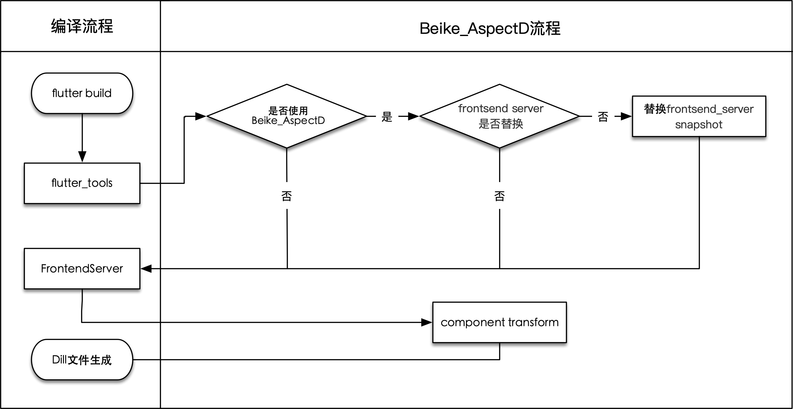
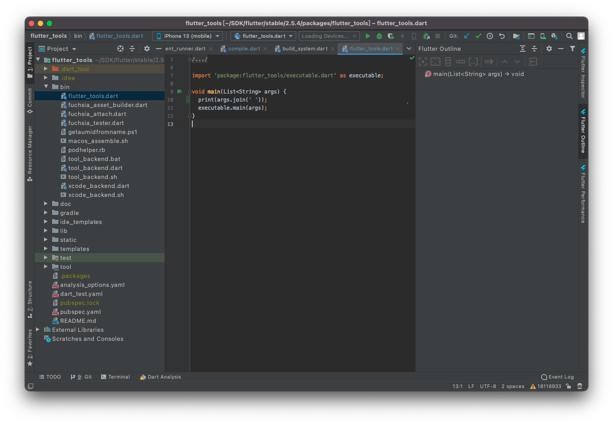
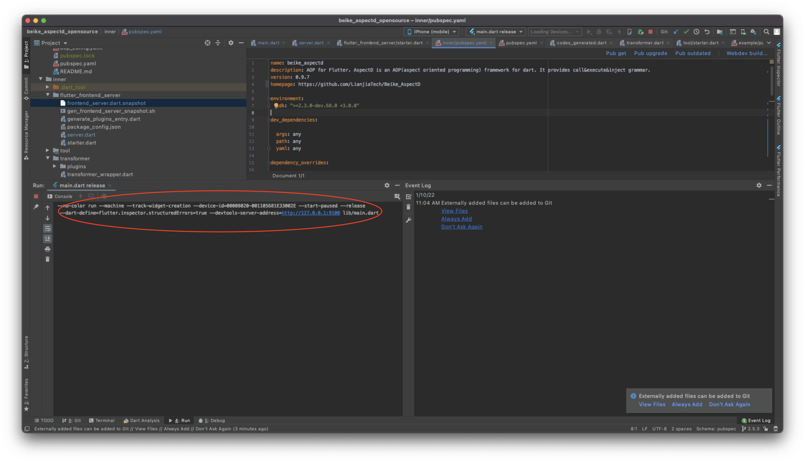
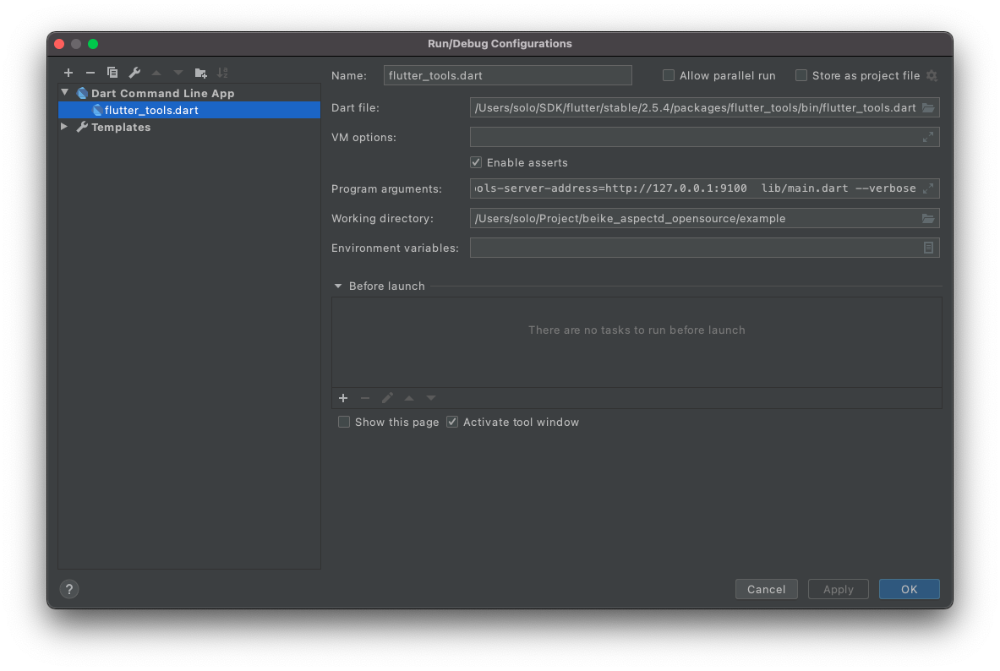
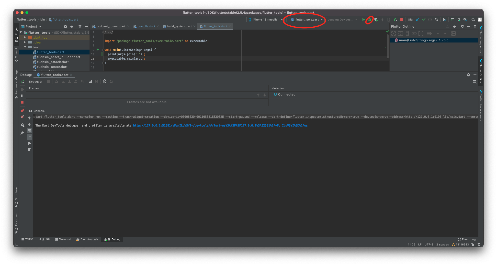
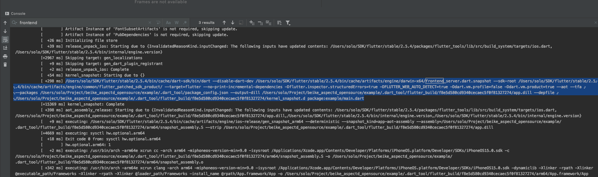
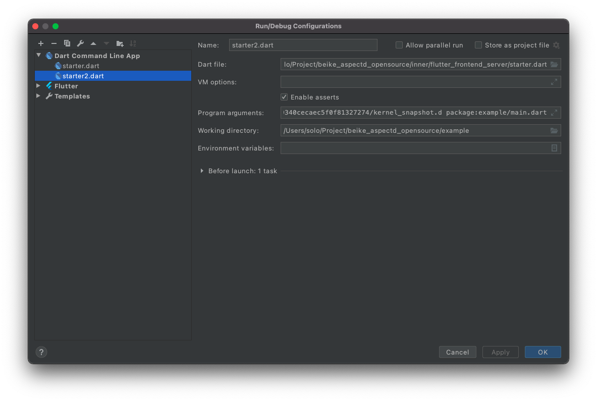

## 原理

如上图，Beike_AspectD主要对Flutter的两个流程进行了修改：

* flutter_tools
* frontend_server

所以我们的调试也是针对这两个流程。

## flutter_tools调试
Beike_AspectD针对flutter_tools的修改是为了让tools能够调到我们的frontend_server.dart.snapshot。所以调试flutter_tools是为了获取调用frontend_server.dart.snapshot的参数。

### 获取flutter_tools参数
首先，我们在flutter_tools入口输出调用flutter_tools的参数。

然后，我们需要删除flutter_tools缓存让这个修改生效。

```
cd path-to/flutter/bin.cache
rm flutter_tools.stamp
```
然后，我们在release模式下运行我们的Example工程，控制台会有如下输出：



```
--no-color run --machine --track-widget-creation --device-id=00008020-001105681E33002E --start-paused --release --dart-define=flutter.inspector.structuredErrors=true --devtools-server-address=http://127.0.0.1:9100 lib/main.dart
```
上面这行命令就是我们调试tools需要的参数。

### 调试flutter_tools
然后，我们我们用Android Studio打开flutter/packages/flutter_tools目录。
添加Dart Command Line App


其中，Dart file选择flutter_tools.dart; Program arguments是我们上一步获得的参数，另外我们需要添加*--verbose*参数来打印出详细的参数；Working directory是我们Example的目录。点击OK后保存。

然后我们选择我们刚添加的Dart Command Line App，点击debug开始调试.



在控制台通过frontend_server关键字获取到调用frontend_server的参数。

```
/Users/solo/SDK/flutter/stable/2.5.4/bin/cache/dart-sdk/bin/dart --disable-dart-dev /Users/solo/SDK/flutter/stable/2.5.4/bin/cache/artifacts/engine/darwin-x64/frontend_server.dart.snapshot --sdk-root /Users/solo/SDK/flutter/stable/2.5.4/bin/cache/artifacts/engine/common/flutter_patched_sdk_product/ --target=flutter --no-print-incremental-dependencies -Dflutter.inspector.structuredErrors=true -DFLUTTER_WEB_AUTO_DETECT=true -Ddart.vm.profile=false -Ddart.vm.product=true --aot --tfa --packages /Users/solo/Project/beike_aspectd_opensource/example/.dart_tool/package_config.json --output-dill /Users/solo/Project/beike_aspectd_opensource/example/.dart_tool/flutter_build/f8e5d580cd9340cecaec5f0f81327274/app.dill --depfile /Users/solo/Project/beike_aspectd_opensource/example/.dart_tool/flutter_build/f8e5d580cd9340cecaec5f0f81327274/kernel_snapshot.d package:example/main.dart
```

有了这个参数，我们就可以开始对frontend_server进行调试了。

## 调试frontend_server
打开我们的Beike_AspectD工程，添加Dart Command Line App，配置如下：



其中，Dart file指定inner/flutter_frontend_server/starter.dart；Program arguments是我们上一步获取的参数，但是由于是源码调试，需要将frontend_server.dart.snapshot路径以及之前的参数去掉，示例如下：

```
--sdk-root /Users/solo/SDK/flutter/stable/2.5.4/bin/cache/artifacts/engine/common/flutter_patched_sdk_product/ --target=flutter --no-print-incremental-dependencies -Dflutter.inspector.structuredErrors=true -DFLUTTER_WEB_AUTO_DETECT=true -Ddart.vm.profile=false -Ddart.vm.product=true --aot --tfa --packages /Users/solo/Project/beike_aspectd_opensource/example/.dart_tool/package_config.json --output-dill /Users/solo/Project/beike_aspectd_opensource/example/.dart_tool/flutter_build/f8e5d580cd9340cecaec5f0f81327274/app.dill --depfile /Users/solo/Project/beike_aspectd_opensource/example/.dart_tool/flutter_build/f8e5d580cd9340cecaec5f0f81327274/kernel_snapshot.d package:example/main.dart

```
Working directory是我们Example的根路径。点击OK进行保存。

然后选择我们刚才配置好的Dart Command Line App就可以开始进行debug了。


